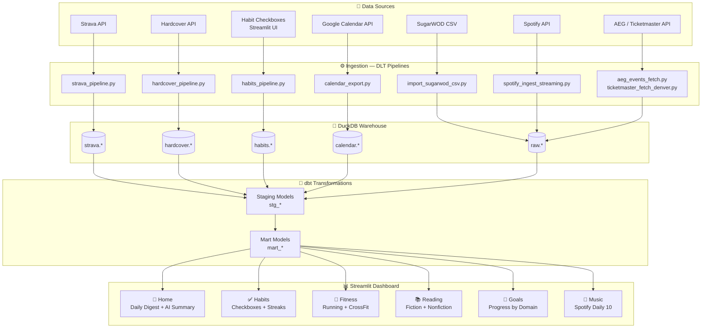
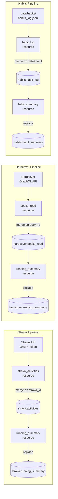
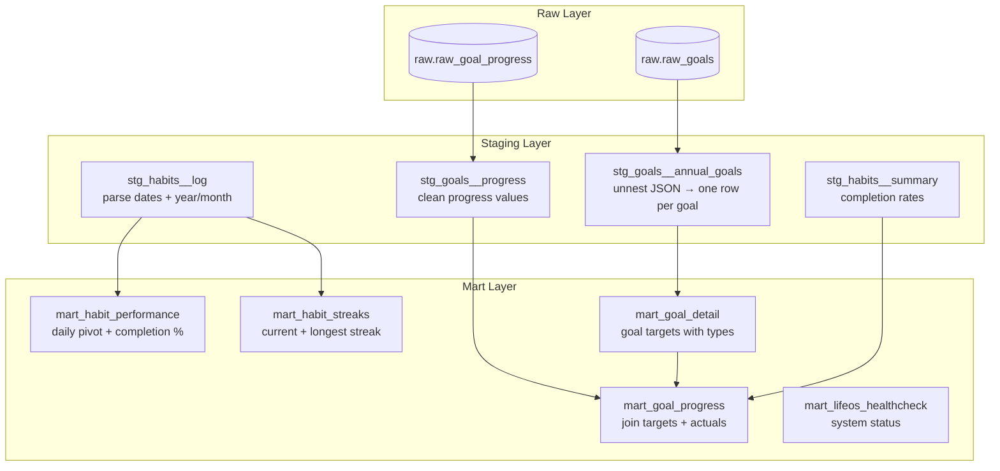
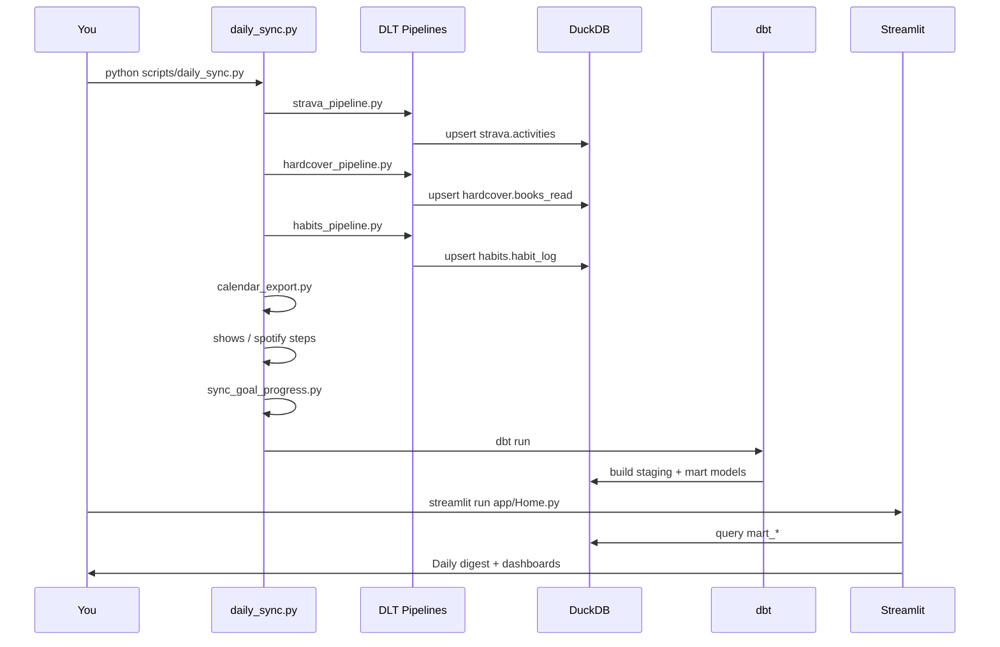

# Life OS 2026

**Life OS 2026** is a personal analytics platform that treats life as a system — observable, measurable, automatable, and continuously improvable.

It uses the same principles that power modern data stacks: declarative intent, automated ingestion, transformation pipelines, and a dashboard for reflection and decision-making.

---

## Architecture

```
External Sources → DLT Pipelines → DuckDB → dbt → Streamlit Dashboard
                                     ↑
                              Local Inputs
                         (habits, SugarWOD CSV)
```

### Full Data Flow



---

### DLT Pipeline Detail



---

### dbt Transformation Layer



---

### Daily Sync Orchestration



---

## Repository Structure

```
life-os-2026/
├── goals/
│   └── 2026.yaml              # Declarative intent — all goals defined here
│
├── pipelines/                 # DLT ingestion pipelines
│   ├── strava_pipeline.py     # Strava API → DuckDB
│   ├── hardcover_pipeline.py  # Hardcover API → DuckDB
│   └── habits_pipeline.py     # Local JSONL → DuckDB
│
├── scripts/                   # Orchestration + auxiliary scripts
│   ├── daily_sync.py          # Daily orchestrator — run this every morning
│   ├── sync_goal_progress.py  # Pull actuals from DuckDB → goal_progress.csv
│   ├── calendar_export.py     # Google Calendar → CSV
│   ├── calendar_metrics.py    # Date night tracking
│   ├── import_sugarwod_csv.py # SugarWOD CSV → DuckDB
│   ├── spotify_*.py           # Spotify ingestion + Daily 10 playlist
│   ├── aeg_events_fetch.py    # AEG concert data
│   └── ticketmaster_fetch_denver.py
│
├── dbt/                       # Transformation layer
│   ├── models/
│   │   ├── staging/           # stg_* — clean + type raw sources
│   │   └── marts/             # mart_* — business logic + goal progress
│   └── profiles/
│
├── app/                       # Streamlit dashboard
│   ├── Home.py                # Entry point — daily digest + AI summary
│   └── pages/
│       ├── 1_Habits.py        # Checkbox logging + streaks + history
│       ├── 2_Fitness.py       # Running + CrossFit lift progressions
│       ├── 3_Reading.py       # Hardcover fiction + nonfiction
│       ├── 4_Goals.py         # Goal progress by domain
│       └── 5_Music.py         # Spotify Daily 10 + streaming stats
│
├── data/                      # Local data (gitignored except examples)
│   ├── warehouse/lifeos.duckdb
│   ├── habits/habits_log.jsonl
│   ├── calendar/
│   ├── spotify/
│   ├── sugarwod/
│   └── manual/goal_progress.csv
│
├── run_pipelines.py           # Run DLT pipelines directly
└── secrets/                   # OAuth tokens (gitignored)
```

---

## Daily Workflow

```bash
# 1. Activate environment
source .venv/bin/activate

# 2. Run everything
python scripts/daily_sync.py

# 3. Open dashboard
streamlit run app/Home.py
```

**Or run specific steps:**
```bash
python scripts/daily_sync.py --only pipelines    # DLT only
python scripts/daily_sync.py --only dbt          # sync + dbt only
python scripts/daily_sync.py --skip spotify      # skip a step
```

---

## Setup

### Prerequisites
- Python 3.12+
- [uv](https://github.com/astral-sh/uv) (recommended) or pip

### Install
```bash
git clone https://github.com/cnvertbleweathr/life-os-2026.git
cd life-os-2026
uv sync
source .venv/bin/activate
```

### Configure
Copy `.env.example` to `.env` and fill in your credentials:

```bash
cp .env.example .env
```

Required keys:
| Key | Source |
|---|---|
| `STRAVA_CLIENT_ID` / `STRAVA_CLIENT_SECRET` | [Strava API](https://www.strava.com/settings/api) |
| `HARDCOVER_TOKEN` | [Hardcover Settings](https://hardcover.app/account/api) |
| `SPOTIFY_CLIENT_ID` / `SPOTIFY_CLIENT_SECRET` | [Spotify Developer](https://developer.spotify.com/dashboard) |
| `OPENAI_API_KEY` | [OpenAI](https://platform.openai.com/api-keys) |
| `TICKETMASTER_API_KEY` | [Ticketmaster Developer](https://developer.ticketmaster.com) |

### First Run
```bash
# Authenticate Strava (one-time OAuth)
python scripts/strava_auth.py

# Set up Google Calendar credentials
# → Download OAuth JSON from Google Cloud Console
# → Save to secrets/google_calendar_credentials.json
python scripts/calendar_export.py  # opens browser for OAuth

# Create warehouse directory
mkdir -p data/warehouse data/habits

# Run everything
python scripts/daily_sync.py
```

---

## Data Sources

| Source | Method | Cadence | What it tracks |
|---|---|---|---|
| Strava | DLT + OAuth | Daily | Running miles, pace, weekly volume |
| Hardcover | DLT + GraphQL | Daily | Books read, fiction vs nonfiction |
| Habits | Streamlit UI | Daily | Meditation, pushups, reading pages |
| Google Calendar | OAuth API | Daily | Date nights, events, birthdays |
| SugarWOD | CSV export | Manual | CrossFit classes, PRs, lift weights |
| Spotify | JSON export | On receipt | Streaming minutes, top artists/tracks |
| AEG / Ticketmaster | Public API | Daily | Upcoming Denver concerts |

---

## Design Principles

**Separation of concerns** — intent (`goals/2026.yaml`), facts (`data/`), and logic (`scripts/`, `dbt/`) are explicitly separated. Goals evolve without rewriting logic.

**Automation over willpower** — if a metric matters, it's automatically ingested, computed, and surfaced. Manual effort is treated as technical debt.

**DuckDB as the hub** — all sources land in DuckDB. dbt builds clean marts on top. The dashboard queries marts only.

**Append-only history** — raw data is never mutated. DLT handles merge/replace semantics at the pipeline level.

**AI as co-processor** — used for bounded, testable tasks: daily digest generation, playlist cover art. Never for core data logic.
