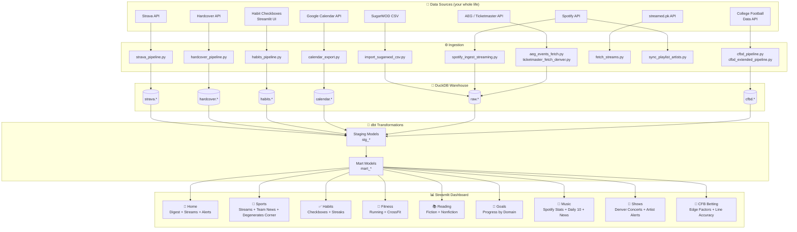
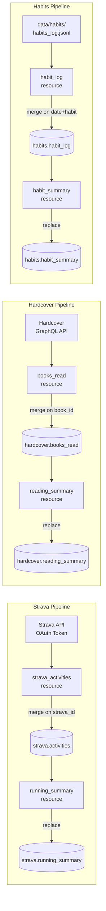
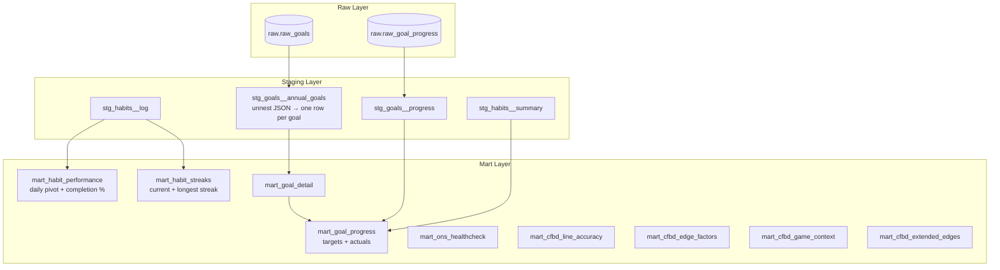
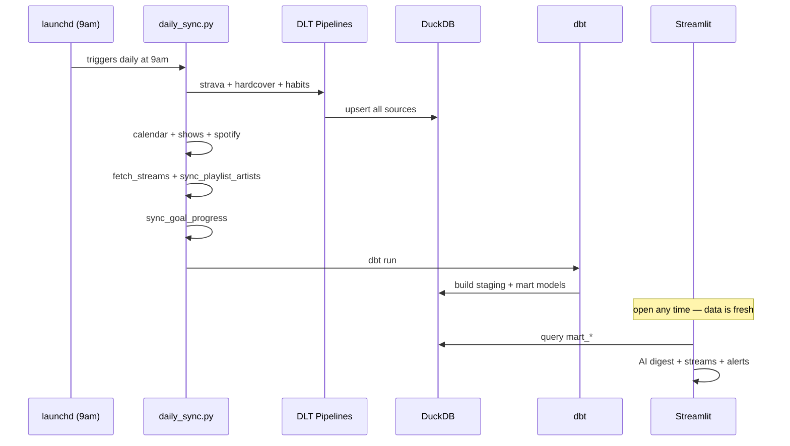

# Operating Narcisystem (ONS) 2026

**Because if you're going to be obsessed with yourself, you might as well make it a data pipeline.**

ONS is a personal analytics platform that treats life as a system — observable, measurable, automatable, and continuously improvable. It ingests your entire existence, runs it through a data stack, and tells you whether you're actually getting shit done or just think you are.

Built on the same principles as modern data infrastructure, because your 9am runs and CrossFit PRs deserve the same rigor as production databases.

---

## Architecture

```
Your Life → DLT Pipelines → DuckDB → dbt → Streamlit Dashboard
                                ↑
                         Local Inputs
                    (habits, SugarWOD CSV, goals YAML)
```

### Full Data Flow



---

### DLT Pipeline Detail



---

### dbt Transformation Layer



---

### Daily Sync Orchestration



---

## Repository Structure

```
ons-2026/
├── goals/
│   └── 2026.yaml                      # What you said you'd do. No judgment.
│
├── pipelines/                         # DLT ingestion pipelines
│   ├── strava_pipeline.py             # Strava API → DuckDB
│   ├── hardcover_pipeline.py          # Hardcover API → DuckDB
│   ├── habits_pipeline.py             # Local JSONL → DuckDB
│   ├── cfbd_pipeline.py               # CFB games, lines, SP+ ratings → DuckDB
│   └── cfbd_extended_pipeline.py      # Weather, coaches, PPA, returning production → DuckDB
│
├── scripts/                           # Orchestration + auxiliary scripts
│   ├── daily_sync.py                  # ← The one command to rule them all
│   ├── sync_goal_progress.py          # Pull actuals from DuckDB → goal_progress.csv
│   ├── sync_playlist_artists.py       # Tewnidge + Deeds artists → show cross-reference
│   ├── fetch_streams.py               # Today's sports streams via streamed.pk
│   ├── calendar_export.py             # Google Calendar → CSV
│   ├── calendar_metrics.py            # Date night tracking (you're welcome)
│   ├── import_sugarwod_csv.py         # SugarWOD CSV → DuckDB
│   ├── spotify_ingest_streaming.py    # Spotify JSON export → streams_clean.csv
│   ├── spotify_metrics.py             # Compute YTD listening stats
│   ├── spotify_daily10_playlist.py    # Generate Daily 10 playlist (Bucket A + B)
│   ├── spotify_daily10_decorate.py    # AI cover art (gpt-image-1 + retry logic)
│   ├── aeg_events_fetch.py            # AEG concert data → Denver shows
│   ├── ticketmaster_fetch_denver.py   # Ticketmaster → Denver shows
│   ├── pregame_lookup.py              # CFB pre-game edge report (queries DuckDB)
│   ├── cfb_backtest.py                # Simulate $1 bets on historical games
│   ├── cfb_edge_validation.py         # Cross-season edge validation (2021-2025)
│   ├── cfb_team_analysis.py           # Per-team ATS profiles
│   └── cfb_build_team_profiles.py     # Build cfbd.team_profiles (run annually)
│
├── dbt/                               # Transformation layer
│   ├── models/
│   │   ├── staging/                   # stg_* — clean + type raw sources
│   │   └── marts/                     # mart_* — business logic, CFB betting, goal progress
│   └── profiles/
│
├── app/                               # Streamlit dashboard
│   ├── Home.py                        # Entry point — digest, streams, artist alerts
│   ├── ons_theme.py                   # Retro-futuristic CSS theme (apply on every page)
│   └── pages/
│       ├── 0_Sports.py                # Live streams + team news + Degenerates Corner
│       ├── 1_Habits.py                # Did you meditate? Do pushups? Read? The data knows.
│       ├── 2_Fitness.py               # Running (Strava) + CrossFit lift progressions
│       ├── 3_Reading.py               # Books: fiction escapism + nonfiction guilt
│       ├── 4_Goals.py                 # What you said you'd do vs what you actually did
│       ├── 5_Music.py                 # Spotify stats + Daily 10 embed + Music News
│       ├── 6_Shows.py                 # Denver concerts + ⭐ artist matching + ticket links
│       └── 7_CFB_Betting.py           # Validated edges, line accuracy, team profiles
│
├── data/                              # Your entire life, locally stored
│   ├── warehouse/ons.duckdb           # DuckDB warehouse (gitignored, obviously)
│   ├── habits/habits_log.jsonl        # Habit log (gitignored)
│   ├── calendar/
│   ├── spotify/
│   │   └── processed/daily10_latest.json  # Daily 10 pointer + description + Tewnidge artists
│   ├── sugarwod/
│   ├── shows/
│   ├── streams/today.json             # Live sports streams
│   └── manual/goal_progress.csv
│
├── notebooks/
│   ├── 01_line_accuracy_overview.ipynb
│   └── 02_extended_factors.ipynb
│
├── run_pipelines.py                   # Run DLT pipelines directly
└── secrets/                           # OAuth tokens (gitignored, not that kind)
```

---

## Daily Workflow

Runs automatically at 9am via launchd. You don't have to do anything. The system knows.

```bash
source .venv/bin/activate
python scripts/daily_sync.py
streamlit run app/Home.py
```

**Surgical strikes:**
```bash
python scripts/daily_sync.py --only pipelines    # DLT only
python scripts/daily_sync.py --only dbt          # sync + dbt only
python scripts/daily_sync.py --skip spotify      # skip a step
python scripts/daily_sync.py --only aeg_events ticketmaster shows_metrics
```

**Important:** DuckDB only allows one writer at a time. Stop Streamlit before running the sync, or you'll hit a lock conflict.

---

## Setup

### Prerequisites
- Python 3.12+
- [uv](https://github.com/astral-sh/uv)
- A concerning amount of self-interest

### Install
```bash
git clone https://github.com/cnvertbleweathr/ons-2026.git
cd ons-2026
uv sync
source .venv/bin/activate
```

### Configure
```bash
cp .env.example .env
# Fill in your credentials. All of them.
```

| Key | Source |
|---|---|
| `STRAVA_CLIENT_ID` / `STRAVA_CLIENT_SECRET` | [Strava API](https://www.strava.com/settings/api) |
| `HARDCOVER_TOKEN` | [Hardcover Settings](https://hardcover.app/account/api) |
| `SPOTIFY_CLIENT_ID` / `SPOTIFY_CLIENT_SECRET` | [Spotify Developer](https://developer.spotify.com/dashboard) |
| `OPENAI_API_KEY` | [OpenAI](https://platform.openai.com/api-keys) — daily digest + Daily 10 cover art |
| `ANTHROPIC_API_KEY` | [Anthropic](https://console.anthropic.com/) — reserved for future AI features |
| `NEWS_API_KEY` | [NewsAPI](https://newsapi.org) — Home, Sports, and Music news feeds |
| `TICKETMASTER_API_KEY` | [Ticketmaster Developer](https://developer.ticketmaster.com) |
| `CFBD_API_TOKEN` | [CFBD](https://collegefootballdata.com) — Patreon tier for weather endpoint |

### First Run
```bash
# One-time OAuth dances
python scripts/strava_auth.py
python scripts/calendar_export.py  # opens browser

# Create directories
mkdir -p data/warehouse data/habits

# Boot the system
python scripts/daily_sync.py

# Open the dashboard and contemplate your life choices
streamlit run app/Home.py
```

### SugarWOD (manual — they don't have an API, barbarians)
```bash
python scripts/import_sugarwod_csv.py --input /path/to/workouts.csv
```

### Spotify Streaming History
Request from Spotify → Account → Privacy Settings → Request Data. Takes a few days. Worth it.
```bash
python scripts/spotify_ingest_streaming.py
python scripts/spotify_metrics.py
```

### CFB Betting Setup
```bash
# Load historical data (2021-2025)
python pipelines/cfbd_pipeline.py
python pipelines/cfbd_extended_pipeline.py

# Build team ATS profiles (run once, then annually at season start)
python scripts/cfb_build_team_profiles.py --min-games 15

# Pre-game lookup
python scripts/pregame_lookup.py --home "Ohio State" --away "Michigan" --spread -7 --ou 45.5
```

---

## Data Sources

| Source | Method | Cadence | What it tracks |
|---|---|---|---|
| Strava | DLT + OAuth | Daily | Running miles, pace, weekly volume |
| Hardcover | DLT + GraphQL | Daily | Books read, fiction vs nonfiction |
| Habits | Streamlit UI | Daily | Meditation, pushups, reading pages |
| Google Calendar | OAuth API | Mon/Thu | Date nights, events, birthdays you shouldn't forget |
| SugarWOD | CSV export | Manual | CrossFit classes, PRs, lift progressions |
| Spotify | JSON export + API | Daily | Streaming stats, Daily 10 playlist + AI cover art |
| AEG / Ticketmaster | Public API | Daily | Upcoming Denver concerts |
| streamed.pk | Public API | Daily | Live sports streams, AI-ranked top 5 |
| CFBD | DLT + Bearer token | Annual | CFB games, lines, SP+, PPA, weather, coaches (2021–2025) |

---

## Dashboard Pages

| Page | What it shows |
|---|---|
| 🧭 **Home** | AI daily digest, sports streams, ⭐ artist show alerts, calendar, goals scoreboard, news ticker |
| 🏈 **Sports** | Live streams, team news, Degenerates Corner (CFB/NFL picks) |
| ✅ **Habits** | Did you meditate? Do pushups? Read? The data knows. |
| 💪 **Fitness** | Strava running metrics + weekly chart, CrossFit lift progressions + PR log |
| 📚 **Reading** | Hardcover fiction/nonfiction progress, book list with classification |
| 🎯 **Goals** | What you said you'd do vs what you actually did |
| 🎵 **Music** | Daily 10 embed + AI cover art description, Spotify YTD stats, listening heatmap, Music News |
| 🎸 **Shows** | Upcoming Denver concerts, ⭐ Tewnidge/Deeds artist matching, ticket links |
| 🎰 **CFB Betting** | Validated edge factors, line accuracy (2021–2025), team ATS profiles, pre-game signals |

---

## CFB Betting System

Cross-season validated edges (2021–2025, 4,793 games):

| Strategy | Win% | ROI | Seasons profitable |
|---|---|---|---|
| PPA gap >0.30 | 74.4% | +41.9% | — |
| PPA gap >0.15 + spread ≤14 | 69.0% | +31.8% | Best combo |
| PPA gap >0.15 + SP+ agrees + spread ≤17 | 67.2% | +28.3% | — |
| PPA gap >0.15 (baseline) | 62.3% | +19.0% | **5/5 seasons** |

Full team profiles for all 263 FBS teams stored in `cfbd.team_profiles`. Pre-game lookup available via `pregame_lookup.py`.

---

## Design Principles

**Separation of concerns** — intent (`goals/2026.yaml`), facts (`data/`), and logic (`scripts/`, `dbt/`) are explicitly separated. What you want to do and what you actually do live in different tables for a reason.

**Automation over willpower** — runs at 9am daily via launchd. Willpower is finite. Cron jobs are not.

**DuckDB as the hub** — all sources land in DuckDB. dbt builds clean marts on top. The dashboard queries marts only. No spaghetti.

**DLT for extraction** — schema inference, merge semantics, and load state handled by DLT. No bespoke fetch scripts held together with prayers.

**AI as co-processor** — used for bounded, testable tasks: daily digest, sports stream ranking, playlist cover art, news feeds. Never for core data logic. The AI assists. The data tells the truth.
